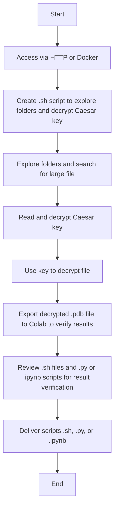

### Stage 2 Challenges
<div align="center" style="background-color: white; padding: 15px; border-radius: 8px; display: inline-block; margin: 0 auto;">
  
</div>

<div align="center" style="margin-top: 15px;">
  
  
  
</div>

---

# EPIC Challenge AECC Round

## Technical Introduction

This document provides step-by-step instructions to connect and complete this stage of the **EPIC Challenge**, a CTF (Capture The Flag)-type exercise involving directory navigation, key file search, password decryption, and file decryption.

---

## Challenge Objectives

According to the provided information, your mission is:

1. Navigate through a directory structure
2. Find a password encrypted with Caesar cipher
3. Find a target encrypted file
4. Decrypt the target file using the found password

###  Hint 
You can use the file weight to find it

---

## Accessing the Environment

### Via Browser

[Terminal Accesible por el navegador](http://shortline.proxy.rlwy.net:53282/)

```
User: epic_guest  
Password: epic_guest
```

### Local Alternative

Alternatively, you can access via SSH:

* [Imagen de Docker](https://drive.google.com/drive/u/0/folders/1gY8ZtA_0j8u8SzFG6WW-2v7EmTt2oMSS)

Una vez que descargaste e importaste la imagen con:

```
docker load -i epic_challenge_image.tar
```

Puedes verificar que está disponible con:

```
REPOSITORY             TAG       IMAGE ID       CREATED         SIZE
epic_challenge_image   latest    abcdef123456   x minutes ago   x MB
```

Ejecuta esto para probar:

```
docker run -it --name epic_challenge_container epic_challenge_image
docker run -it --rm epic_challenge
```

---

## Encrypted File Handling Process Diagram



---

## Environment Structure

The script sets up the following environment:

* 20 main directories (`dir1` to `dir20`)
* Each main directory contains 5 subdirectories (`maybehere1` to `maybehere5`)
* Each subdirectory contains 5 files (`file1.txt` to `file5.txt`)

---

## Deliverable

You must submit **two files**:

* A `.sh` script to validate the process used to locate the file.
* A `.py` or `.ipynb` file to validate the result obtained.

The submission should follow this format:
[Colab Deliverable Example](https://colab.research.google.com/drive/1AG0d2z8kajN1Y8asFLcHd6FqHbgoRZf3?usp=sharing)

---

## Metodología de Evaluación

| **Criterios** | **Insuficiente (0 Puntos)** | **Aceptable (1 Punto)** | **Bueno (2 Puntos)** | **Excelente (3 Puntos)** | **Peso** |
|---------------|------------------------------|--------------------------|------------------------|---------------------------|----------|
| **Análisis del Entorno** | No logra navegar por el sistema ni identificar la estructura básica del desafío. | Identifica la estructura básica pero no detecta las pistas falsas. Realiza exploración limitada. | Realiza una exploración sistemática y detecta las pistas falsas después de analizar el entorno. | Análisis exhaustivo del entorno, rápida identificación de pistas verdaderas y falsas, documentación completa del proceso. | 20% |
| **Resolución Criptográfica** | No identifica el cifrado César ni logra recuperar la contraseña. | Identifica que existe un cifrado pero necesita ayuda significativa para resolverlo. | Identifica correctamente el cifrado César y recupera la contraseña con mínima asistencia. | Identifica inmediatamente el cifrado César, determina el desplazamiento correcto y recupera la contraseña de forma autónoma. | 25% |
| **Técnicas de Recuperación** | No logra encontrar el archivo objetivo real ni aplicar técnicas de descifrado. | Encuentra el archivo objetivo pero no logra aplicar todas las técnicas de descifrado necesarias. | Encuentra el archivo objetivo y aplica la mayoría de las técnicas de descifrado con algunos errores menores. | Encuentra el archivo objetivo rápidamente y aplica todas las técnicas de descifrado (AES y múltiples descompresiones) correctamente. | 30% |
| **Automatización y Scripting** | No implementa ninguna automatización, proceso completamente manual. | Implementa scripts básicos para algunas tareas pero la mayoría del proceso es manual. | Implementa scripts efectivos para automatizar la mayoría de las etapas del desafío. | Desarrolla un sistema de scripts completo que automatiza todo el proceso de principio a fin con manejo de errores. | 15% |
| **Documentación y Reporte** | No proporciona documentación del proceso de resolución. | Documentación básica que omite detalles importantes del proceso de resolución. | Documentación clara que cubre la mayoría de los pasos y técnicas utilizadas. | Documentación exhaustiva, bien estructurada, con explicaciones detalladas de cada técnica y decisión tomada. | 10% |
