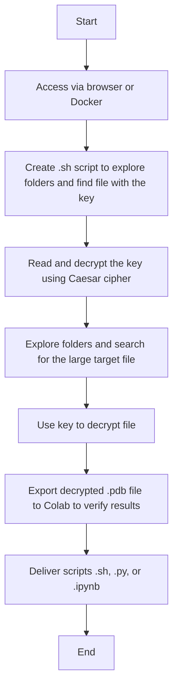

# EPIC Challenge AECC Round

# Cybersecuirity: Capture the Flag


<div align="center" style="background-color: white; padding: 15px; border-radius: 8px; display: inline-block; margin: 0 auto;">
  
</div>

<div align="center" style="margin-top: 15px;">
  
  
  
</div>

---


## Technical Introduction

This document provides step-by-step instructions to connect and complete this stage of the **EPIC Challenge**, a CTF (Capture The Flag)-type exercise involving directory navigation, key file search, password decryption, and file decryption.

---

## Challenge Objectives

According to the provided information, your mission is:

1. Navigate through a directory structure
2. Find a password encrypted with Caesar cipher
3. Find a target encrypted file
4. Decrypt the target file using the found password
5. Visualise the content of the target file

###  Hint 
You can use the file size to find the target.

---

## Accessing the Environment

### Via Browser

[Terminal Accesible por el navegador](http://shortline.proxy.rlwy.net:53282/)

```
User: epic_guest  
Password: epic_guest
```

### Local Alternative

Alternatively, you can access via SSH:

* [Imagen de Docker](https://drive.google.com/drive/u/0/folders/1gY8ZtA_0j8u8SzFG6WW-2v7EmTt2oMSS)

Once you have downloaded the Docker image, load the image with:

```
docker load -i epic_challenge_image.tar
```

You can verify the environment with:

```
REPOSITORY             TAG       IMAGE ID       CREATED         SIZE
epic_challenge_image   latest    abcdef123456   x minutes ago   x MB
```

You can test the environment with:

```
docker run -it --name epic_challenge_container epic_challenge_image
docker run -it --rm epic_challenge
```

---

## Encrypted File Handling Process Diagram



---

## Environment Structure

The Docker image sets up the following environment:

* 20 main directories (`dir1` to `dir20`)
* Each main directory contains 5 subdirectories (`maybehere1` to `maybehere5`)
* Each subdirectory contains 5 files (`file1.txt` to `file5.txt`)

---

## Deliverable

You must submit **two files**:

* A `.sh` script to validate the process used to locate the file.
* A `.py` or `.ipynb` file to validate the result obtained.

The `.py` or `.ipynb` file should follow this format:
[Colab Deliverable Example](https://colab.research.google.com/drive/1AG0d2z8kajN1Y8asFLcHd6FqHbgoRZf3?usp=sharing)

---

## Evaluation Methodology

| **Criteria** | **Insufficient (0 Points)** | **Acceptable (1 Point)** | **Good (2 Points)** | **Excellent (3 Points)** | **Weight** |
|-------------|-----------------------------|---------------------------|----------------------|----------------------------|------------|
| **Environment Analysis** | Fails to navigate the system or identify the basic structure of the challenge. | Identifies the basic structure but misses false clues. Performs limited exploration. | Conducts a systematic exploration and identifies false clues after analyzing the environment. | Thorough environment analysis, quick identification of true and false clues, complete documentation of the process. | 20% |
| **Cryptographic Resolution** | Does not identify the Caesar cipher or recover the password. | Recognizes that a cipher exists but needs significant help to solve it. | Correctly identifies the Caesar cipher and recovers the password with minimal assistance. | Immediately identifies the Caesar cipher, determines the correct shift, and recovers the password independently. | 25% |
| **Recovery Techniques** | Fails to find the real target file or apply decryption techniques. | Finds the target file but cannot apply all necessary decryption techniques. | Finds the target file and applies most decryption techniques with minor errors. | Quickly finds the target file and correctly applies all decryption techniques (AES and multiple decompressions). | 30% |
| **Automation and Scripting** | Implements no automation; the process is entirely manual. | Implements basic scripts for some tasks, but most of the process is manual. | Implements effective scripts to automate most challenge stages. | Develops a complete script system that automates the entire process from start to finish with error handling. | 15% |
| **Documentation and Reporting** | Provides no documentation of the resolution process. | Basic documentation that omits important details of the resolution process. | Clear documentation covering most steps and techniques used. | Comprehensive, well-structured documentation with detailed explanations of each technique and decision made. | 10% |


